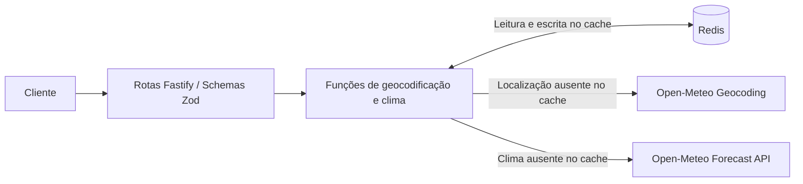

# ArthurLabs Weather API

API REST para consultar o clima atual e a previsão diária em cidades brasileiras. Usa a Open-Meteo como fonte dos dados e Redis para o cache.


## Sobre

Este é um projeto de portfólio da ArthurLabs feito para praticar integração com APIs externas e cache em uma API REST com TypeScript. A aplicação recebe o nome de uma cidade, encontra as coordenadas e busca os dados meteorológicos na Open-Meteo.

A API expõe respostas próprias, valida os parâmetros recebidos, guarda consultas repetidas em cache e usa um formato consistente para erros. Ela cobre clima atual e previsão diária.

## Funcionalidades

- Consulta de clima atual e previsão de 1 a 7 dias.
- Geocodificação de cidades brasileiras e caches Redis independentes por tipo de dado.
- Timeout de 5 segundos nas chamadas ao provedor e continuidade da requisição quando a leitura ou escrita no cache falha.
- Validação com Zod, especificação OpenAPI e documentação interativa com Scalar.
- Limite de 20 requisições por minuto.

## Arquitetura



### Fluxo da requisição

1. A API valida os parâmetros, remove espaços nas extremidades e converte o nome da cidade para minúsculas.
2. Ela procura a localização no Redis. Se não encontrar, consulta a Open-Meteo e armazena o primeiro resultado.
3. Com latitude e longitude, a API procura os dados meteorológicos em cache ou chama o provedor e salva a resposta.
4. A rota devolve `location` junto de `current` ou `forecast`.

Uma resposta em cache elimina a chamada ao provedor daquela etapa.

## Estratégia de cache

| Dados | Chave | TTL |
| --- | --- | --- |
| Geocodificação | `geocoding:{city}:br` | 24 horas |
| Clima atual | `weather:current:{latitude}:{longitude}` | 5 minutos |
| Previsão | `weather:forecast:{latitude}:{longitude}:{days}` | 15 minutos |

As respostas são salvas como JSON com expiração no Redis. Quando uma leitura do cache falha, a aplicação busca o dado no provedor. Quando a escrita falha, ela ainda devolve o dado que acabou de obter. Após o TTL, a próxima consulta atualiza o cache.

## API

| Método | Rota | Entrada / finalidade |
| --- | --- | --- |
| GET | `/weather` | `city` obrigatório, de 1 a 100 caracteres após remover espaços nas extremidades |
| GET | `/weather/forecast` | `city` obrigatório e `days` inteiro opcional, de 1 a 7; padrão 5 |
| GET | `/health` | Estado da aplicação e do Redis |
| GET | `/docs` | Documentação Scalar |
| GET | `/openapi.json` | Especificação OpenAPI gerada |

```bash
curl "http://localhost:3000/weather?city=Niteroi"
curl "http://localhost:3000/weather/forecast?city=Niteroi&days=3"
```

O retorno do clima atual traz temperatura, sensação térmica, umidade, precipitação, código meteorológico, velocidade do vento e horário. A previsão traz data, temperaturas mínima e máxima, probabilidade de precipitação, código meteorológico, nascer e pôr do sol. As duas respostas incluem a localização.

A rota `/health` sempre responde com HTTP 200 e informa `ok` ou `degraded` conforme a conexão com o Redis. Ela não consulta a Open-Meteo.

## Tratamento de erros

O tratador global retorna `{ error, message, statusCode }`.

| HTTP | Código | Causa |
| --- | --- | --- |
| 400 | `VALIDATION_ERROR` | Parâmetros inválidos |
| 404 | `CITY_NOT_FOUND` | Nenhuma cidade encontrada |
| 429 | `TOO_MANY_REQUESTS` | Limite de requisições excedido |
| 503 | `WEATHER_PROVIDER_UNAVAILABLE` | Falha, timeout ou resposta sem sucesso do provedor |
| 500 | `INTERNAL_SERVER_ERROR` | Erro inesperado |

## Tecnologias

Node.js, TypeScript, Fastify, Zod, Redis com ioredis, `fetch` nativo, Open-Meteo, OpenAPI, Scalar, Docker Compose, pnpm e Biome.

## Estrutura do projeto

```text
src/
  server.ts   # Inicialização e registro de rotas
  routes/     # Fluxo HTTP e montagem das respostas
  functions/  # Chamadas à Open-Meteo e uso do cache
  lib/        # Validação de ambiente e acesso ao Redis
  schemas/    # Contratos de entrada/saída e exemplos
  plugins/    # CORS, limites, documentação, arquivos estáticos e erros
  errors/     # Classes de erro da aplicação
  utils/      # Chaves de cache e TTLs
```

## Execução local

Use Node.js 22, que é a versão da imagem Docker, pnpm e Docker Compose para o Redis. Na raiz do repositório, execute:

```bash
pnpm install --frozen-lockfile
cp .env.example .env
docker compose run --rm -d -p 127.0.0.1:6379:6379 redis
pnpm dev
```

No PowerShell, a cópia do arquivo de ambiente é feita com `Copy-Item .env.example .env`.

A documentação local fica em [http://localhost:3000/docs](http://localhost:3000/docs). Para iniciar a API e o Redis em containers:

```bash
docker compose up --build -d
```

## Variáveis de ambiente

O projeto lê o arquivo `.env` e valida as variáveis com Zod na inicialização.

| Variável | Padrão | Validação |
| --- | --- | --- |
| `NODE_ENV` | `development` | `development`, `test` ou `production` |
| `PORT` | `3000` | Inteiro de 1 a 65535 |
| `REDIS_URL` | `redis://localhost:6379` | URL |

No Compose, a API usa `redis://redis:6379` para acessar o Redis pela rede dos containers. Apenas a porta 3000 da API é publicada; o Redis fica restrito à rede interna. O comando de execução local acima publica o Redis somente em `127.0.0.1` para o uso com `pnpm dev`.


## Decisões técnicas

- A geocodificação fica em cache por mais tempo que os dados meteorológicos.
- A chave de previsão inclui o número de dias solicitado.
- Uma indisponibilidade do Redis não impede a consulta à Open-Meteo.
- Os schemas Zod são usados na validação, serialização e geração da documentação OpenAPI.
- Rotas, chamadas ao provedor e infraestrutura compartilhada ficam em módulos separados.

## Limitações conhecidas

- A geocodificação busca apenas cidades do Brasil, usa português e escolhe o primeiro resultado retornado.
- Não há novas tentativas, provedor alternativo ou retorno de dados expirados quando a Open-Meteo falha.
- A resposta da Open-Meteo recebe tipagem TypeScript sem validação de schema em execução. Dados malformados podem causar HTTP 500.
- O limite de requisições fica na memória do processo e o CORS permite qualquer origem.
